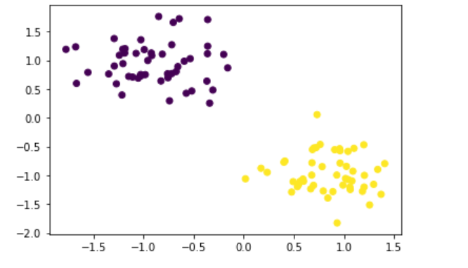

### Simple Fully_connected_neural_network

#### Packages to import
* PyTorch
* Matplotlib
* Numpy
* Sklearn
#### About the neural network in nutshell
> 100 points divided into two classes around the centres (-0.9,0.9) and (0.9,-0.9)  
Adam gradient descent algorithm is used    
Binary cross entropy loss function is used

>Ran it for 4000 epochs  

