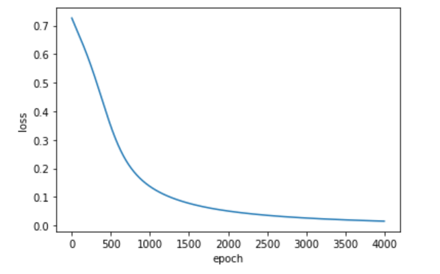

### Simple Fully_connected_neural_network

#### Packages to import
* PyTorch
* Matplotlib
* Numpy
* Sklearn
#### About the neural network in nutshell
> created a dataset using sklearn.datasets of 100 points and then split the dataset into train and test and 
Take a look at datapoints and loss graph

